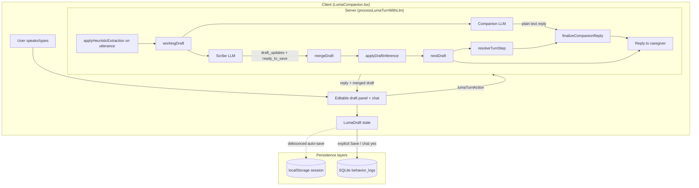
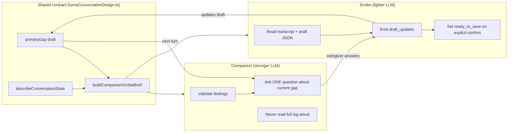
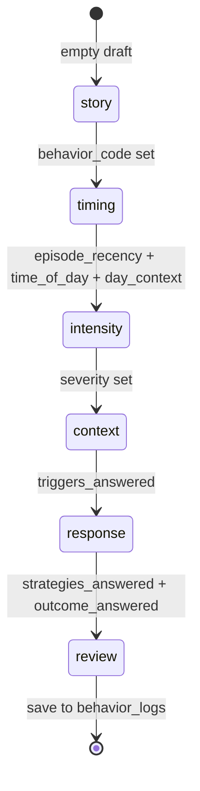
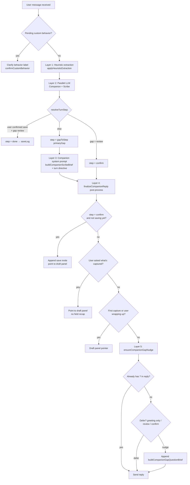

# Luma for Dementia Caregivers — Architecture

**Audience:** Engineering review · Technical portfolio · AI product partners · Senior PM interview deep-dives  
**Last updated:** Jun 2026  
**Product owner lens:** AI PM — structure serves caregiver trust, clinical utility, and operability

---

## 1. System purpose

Luma is a Next.js caregiver app with three incident-logging paths that share one schema, and a dual-audience **Synopsis** that turns those logs into longitudinal value.

| Path | User intent | UX shape |
|------|-------------|----------|
| **Luma companion** | Talk through what happened | Conversational + draft panel + editable review |
| **Coach wizard** | Guided reflection + recommendations | Multi-step wizard (“Guided check-in”) |
| **Quick log** | Fast structured entry | Single form (built; not linked from home UI) |

All paths write to `behavior_logs` → surfaced in **Today**, **History**, and **Synopsis** (caregiver + clinician views, PDF export).

### Product evolution (why three logging paths exist)

| Phase | Capture UX | Structured output | Lesson |
|-------|------------|-------------------|--------|
| **MVP 1 — Clarity log** | Quick log + coach wizard (dropdowns, chips, steps) | Full `behavior_logs` schema | Structure enables patterns and synopsis; forms are skipped in the moment |
| **MVP 2 — Text Luma** | Single LLM chat mirroring wizard fields | Same schema | Robotic, clinical, invisible capture — one agent cannot chat and scribe |
| **MVP 3+ — Companion + Scribe** | Voice/text companion + live draft + editable review | Same schema | Split agents; show draft; narrative gaps; explicit save; caregiver owns record |
| **Current — Synopsis** | Dual-tab report from same logs | Caregiver dashboard + clinician summary + PDF | Structured data pays off only when translated per audience; sample mode shows value before data exists |

**Architectural invariant:** The clarity log schema from MVP 1 is never replaced — Luma is an alternate **capture surface** that converges on the same tables and downstream surfaces (History, Synopsis).

---

## 2. Stack overview

| Layer | Technology |
|-------|------------|
| **Framework** | Next.js 14 (App Router) |
| **UI** | React 18, TypeScript |
| **Styling** | Tailwind CSS 3, custom care design system (`globals.css`) |
| **Database** | SQLite via `better-sqlite3` (file: `data/app.db`; `/tmp` on Vercel) |
| **Validation** | Zod (server actions, repo payloads) |
| **PDF export** | `@react-pdf/renderer` |
| **Luma LLM** | OpenAI or Anthropic — Companion + Scribe parallel calls |
| **Speech input** | Web Speech API (`continuous`, interim results, manual Done) |
| **Speech output** | OpenAI TTS (`tts-1`) via server action; browser TTS fallback |
| **Client session** | `localStorage` draft persistence (`luma-session-v1`) |

Single Node process: Next.js serves UI, runs server actions (LLM, TTS, DB), no separate API server.

---

## 3. Repository layout

```
app/
  layout.tsx                  # Root layout, nav, fonts (DM Sans + Lora)
  page.tsx                    # Server: today's logs + custom behaviors → HomeClient
  HomeClient.tsx              # Entry: Luma · Coach + Today list
  LumaCompanion.tsx           # Chat UI, draft panel, final editor, voice, save flow
  LumaFinalLogEditor.tsx      # Editable review form before commit
  useSpeechRecognition.ts     # STT hook + speakText (OpenAI or browser TTS)
  CoachWizard.tsx             # Guided check-in flow
  QuickLogForm.tsx            # Quick log form (orphaned from home nav)
  SeveritySelector.tsx        # Shared severity cards (coach, quick log, Luma review)
  EpisodeTimingSelector.tsx   # Episode recency / time-of-day / day context
  OnboardingModal.tsx         # First-run care profile
  CareProfileForm.tsx         # Profile fields
  WhatToTryNextCard.tsx       # Post-log recommendations (quick log only)
  actions.ts                  # All server actions (logs, Luma, TTS, profile, report)
  error.tsx / global-error.tsx
  history/                    # List, detail, outcome update
  report/                     # Synopsis — dual-tab UI, helpers, PDF export
    page.tsx                  # Tab shell, period selector, sample mode, auto-fetch
    CaregiverPatternsView.tsx # Actionable caregiver dashboard
    ClinicianSummaryView.tsx  # Chart/data-focused observational summary
    CaregiverSynopsisVisuals.tsx
    SynopsisCharts.tsx        # Donut, bar charts (clinician tab)
    SynopsisExportActions.tsx # Print + PDF (clinician tab, real data only)
    SynopsisPdfExport.tsx
    ReportPDF.tsx             # @react-pdf/renderer document
    synopsisConfig.ts         # Tabs, periods, disclaimers
    synopsisHelpers.ts        # Pattern confidence, glance stats, trigger/strategy builders
    sampleSynopsis.ts         # Mock report when totalIncidents === 0
    SynopsisTabIcon.tsx
  coach-rules/                # Coach rules JSON editor (no nav link)
  profile/                    # Care profile

src/lib/
  db.ts                       # SQLite init, schema, additive migrations
  repo.ts                     # CRUD, list, generateReport(), synopsis queries
  customBehaviors.ts          # CUSTOM_* behavior codes
  coach.ts / coach_rules.json # Recommendation rules
  coachFlowCatalog.ts         # Triggers, strategies, outcomes (shared catalogs)
  coachFlowRecommendations.ts # Post-log “what to try next”
  lumaReflectSuggestions.ts   # Mid-conversation reflect cards (same rule pool as coach)
  behaviorMap.ts              # Behavior codes ↔ labels
  episodeTiming.ts            # Episode timing types + inference helpers
  severityCatalog.ts          # Severity options
  logUtils.ts                 # Client-safe display helpers
  synopsisBuilder.ts          # Clinician synopsis assembly (legacy PDF sections)
  lumaEngine.ts               # LumaDraft, heuristics, finalize, normalizeLumaDraft
  lumaConversationDesign.ts   # Narrative gaps, draft hints, save confirmation
  lumaLlm.ts                  # Companion + Scribe LLM (server-only)
  lumaMessageFormat.ts        # Chat block parsing (paragraphs / bullets)
  lumaTts.ts                  # OpenAI TTS voices (server-only)
  lumaSessionStorage.ts       # localStorage auto-save / restore / clear
  careProfileCookie.ts        # Profile fallback when SQLite unavailable
```

---

## 4. Luma — AI architecture

### 4.1 End-to-end turn loop

Each caregiver message triggers one **turn** through `lumaTurnAction` → `processLumaTurnWithLlm` (or heuristic fallback). The loop below is the core runtime path.



**Key files:** `app/LumaCompanion.tsx` · `app/actions.ts` · `src/lib/lumaLlm.ts` · `src/lib/lumaEngine.ts` · `src/lib/lumaConversationDesign.ts`

### 4.2 Companion–Scribe partnership

The two agents are **not independent silos**. They share the same picture of capture progress and play complementary roles on every turn.



| Agent | Input each turn | Output | Partnership rule |
|-------|-----------------|--------|------------------|
| **Companion** | History + `workingDraft` + `buildCompanionScribeBrief` | Plain-text reply | **Leads** — caregivers rarely ask “what else do you need?”; companion asks about the current gap after acknowledging |
| **Scribe** | History + `workingDraft` + same capture status via `describeConversationState` | `{ draft_updates, ready_to_save? }` | **Captures** — extracts answers from what the companion drew out; never speaks to the user |
| **Heuristics** | Same utterance, always first | Patched `workingDraft` | **Backfill** — behavior/trigger/timing hints; full fallback voice when LLM unavailable |

Both LLM calls run **in parallel** on the same `workingDraft` (heuristic-preprocessed). The companion does not wait for the scribe’s JSON on that turn; merged scribe output becomes `nextDraft` for the **next** turn and for the draft panel immediately after the turn completes.

Env-configured models; provider selection via `OPENAI_API_KEY`, `ANTHROPIC_API_KEY`, `LUMA_LLM_PROVIDER`.

### 4.3 Narrative gap model (`primaryGap`)

Not wizard steps — **thematic gaps** (`lumaConversationDesign.ts`). Only **one** gap is “priority” at a time; the companion asks about that gap, not the whole form.



| Gap | Missing until | Example companion question (warm, not schema jargon) |
|-----|---------------|------------------------------------------------------|
| `story` | `behavior_code` or custom behavior | “What’s been happening? You can start anywhere.” |
| `timing` | Episode recency, time of day, day context | “When did that happen — just now, earlier today, or a few days ago?” |
| `intensity` | `severity` | “That must have been hard. How intense was it for you?” |
| `context` | `triggers_answered` (chips, detail, or skip) | “Do you have a sense of what might have led to it? We can reflect on it together.” |
| `response` | `strategies_answered` then `outcome_answered` | “Did you try anything to help?” → “Did any of that seem to help?” |
| `review` | All above | “If your draft log below looks right, say yes to save.” |

`applyDraftInference()` marks gaps answered when data is already present (including manual edits in the draft panel).

### 4.4 Companion decision layers

Companion behavior is not a single prompt — it is **layered**. Lower layers run first; later layers can append or override tone.



#### Layer reference

| Layer | Trigger | Typical outcome | Acknowledge only? |
|-------|---------|-------------------|-------------------|
| **0 — Routing** | `pendingCustomLabel`, greeting, no behavior yet | Welcome, invite story, or **behavior clarifying question** (“Would *wandering* fit?”) | Yes for pure greeting (`shouldDeferGapNudge`) |
| **1 — Heuristics** | Every utterance | Pre-fill draft before LLMs run | N/A (silent) |
| **2 — Companion LLM** | LLM configured | Acknowledge + **one gap question** per prompt contract | Only if model ignores contract |
| **2 — Scribe LLM** | LLM configured | Silent `draft_updates` | N/A |
| **3 — Step resolution** | After merge | `confirm` / `done` / gap step | N/A |
| **4 — finalizeCompanionReply** | Special user intents | Draft panel pointer; save invite at confirm | Mirror/wrap-up paths |
| **5 — Gap backstop** | Reply has no `?` and gap ≠ review | Append brief gap question | **No** — adds question companion omitted |

#### When the companion acknowledges vs asks

| Situation | Behavior | Mechanism |
|-----------|----------|-----------|
| Short greeting at start | Acknowledge only; defer gap question | `shouldDeferGapNudge` |
| User shares emotional story | Acknowledge first, then **one gap question** | Companion prompt + `ensureCompanionGapNudge` |
| User dumps many details at once | Acknowledge; scribe fills multiple fields; companion **does not re-ask** captured gaps | `describeConversationState` “Already understood” |
| Behavior unclear | **Clarifying question** (label fit?), not gap question | `processLumaTurn` / `needsCustomBehavior` |
| User asks “what do you have?” | Point to draft panel; **no** field readback | `userAskingForDraftSummary` |
| All gaps filled | Invite save; show `LumaFinalLogEditor` | `primaryGap === review` |
| LLM only empathizes, no question | Acknowledge + **appended gap question** | `ensureCompanionGapNudge` |
| Heuristic fallback (no API) | Reflect + gap follow-up in one message | `generateNaturalFollowUp` + `ensureCompanionGapNudge` |

**Design intent:** The companion is **proactive** — it leads the caregiver through gaps. It is not waiting for “what else do you need?” Clarifying questions (behavior label, custom behavior confirm) are a separate branch from gap questions (timing, intensity, possible triggers, strategies).

### 4.5 Trust boundary: draft vs record

| Stage | Storage | User action |
|-------|---------|-------------|
| In conversation | React state + `localStorage` auto-save (3s debounce, 30s interval) | Edit via chat or **editable draft panel**; scribe + companion update live |
| Review | `LumaFinalLogEditor` (full review + Save / Keep talking) | Edit any field directly |
| Commit | SQLite `behavior_logs` | **Save to log** or explicit chat “yes” only |

`submitLumaLogAction` → same payload shape as coach flow (behavior, severity, episode fields, triggers, strategies, outcome, notes, recommendations).

**Not auto-written:** Scribe `ready_to_save` alone does not persist; prevents silent incorrect clinical rows.

### 4.6 Mid-conversation recommendations

`lumaReflectSuggestions.ts` surfaces rule-based “reflect” cards during Luma chat when triggers/strategies are known — same recommendation pool as coach wizard, without breaking conversational flow.

### 4.7 Session persistence (`lumaSessionStorage.ts`)

```typescript
luma-session-v1 → { draft, messages, step, keepTalkingDismissed, savedAt }
```

- **Load:** `normalizeLumaDraft()` ensures arrays exist (prevents crash on corrupt partial saves)
- **Save:** debounced on draft/messages/step changes
- **Clear:** on successful `submitLumaLogAction`

### 4.8 Extraction safeguards

- **Time vs trigger:** Time-category chips (Morning, Sundowning, …) excluded from trigger hypotheses; sleep → FATIGUE heuristic
- **Custom behaviors:** Unknown behavior → propose label → `createCustomBehaviorAction` → `CUSTOM_*` code
- **Inference flags:** `triggers_answered`, `strategies_answered`, `outcome_answered` inferred when data present

### 4.9 Voice pipeline

```
STT: useSpeechRecognition → continuous, interim preview, Done to submit
TTS: speakText → synthesizeLumaSpeechAction (OpenAI) OR browser SpeechSynthesis
Voice preference: localStorage (shimmer / nova / coral / alloy)
```

---

## 5. Synopsis — dual-audience reporting

**Route:** `/report` · **Nav label:** Synopsis

### 5.1 Tab model (`synopsisConfig.ts`)

| Tab | Default period | Audience | UX goal |
|-----|----------------|----------|---------|
| **For caregivers** | 30 days | Family caregiver | Actionable patterns — what to reduce, what helped, what to try, appointment questions |
| **For clinicians** | 180 days | Care team / neurologist visit prep | Observational summary — charts, coverage metrics, discussion questions; explicitly not a clinical assessment |

Shared period options: 30 / 90 / 180 days. Auto-fetch on tab or period change via server actions.

### 5.2 Sample mode (zero-data activation)

When `generateReport()` returns `totalIncidents === 0`:

- Inject mock data from `sampleSynopsis.ts`
- Show labeled **Sample report** banners + CTAs to start logging
- Mock profile lines for realistic preview
- PDF export disabled until real data exists

### 5.3 Caregiver dashboard (`CaregiverPatternsView.tsx` + `synopsisHelpers.ts`)

| Section | Builder / logic |
|---------|-----------------|
| This period at a glance | `buildCaregiverGlanceStats` |
| Top recurring behaviors | `buildCaregiverBehaviorRows` + pattern confidence badges |
| Triggers you may be able to reduce | `buildReducibleTriggers` |
| Strategies that seemed to help | `buildHelpfulStrategies` |
| Strategies to rethink | `buildStrategiesToRethink` |
| Try this next month | `buildTryNextMonthTips` |
| Questions for appointment | `buildCaregiverAppointmentQuestions` |

Pattern confidence: **Strong pattern** (5+ logs or 3+ over multi-week) · **Early signal** (2–4) · **Not enough data** (1).

### 5.4 Clinician summary (`ClinicianSummaryView.tsx`)

- Observational care log summary (non-diagnosis framing)
- Data coverage tiles, trend, behavior frequency/severity charts
- Time-of-day, trigger category, strategy outcome visualizations
- Discussion question cards
- **Print** + **Export PDF** (`ReportPDF.tsx`) when real data present

### 5.5 Data pipeline

```
behavior_logs (SQLite)
        │
        ▼
repo.generateReport(days)
        │
        ├── CaregiverPatternsView (actionable dashboard)
        └── ClinicianSummaryView (charts + PDF)
```

User-facing terminology: **care observations** (not “moments”). Disclaimer on all synopsis surfaces: *Based on caregiver-entered logs. Not medical advice.*

---

## 6. Core app data flow

### Reads
Server components call `repo` / `customBehaviors` → pass props to client. No REST layer.

### Writes
Client → server actions (`app/actions.ts`) → `repo` → `revalidatePath`.

### Client boundary
Browser code must **not** import `repo`, `db`, `lumaLlm`, `lumaTts`. Use server actions and client-safe libs (`logUtils`, catalogs, `lumaSessionStorage`).

---

## 7. Database

**File:** `data/app.db` (git-ignored, runtime-created)

| Table | Purpose |
|-------|---------|
| `care_recipients` | Default recipient + onboarding/profile fields |
| `behavior_logs` | All incidents (coach, quick, Luma) |
| `coach_rules` | Single-row JSON rules |
| `custom_behaviors` | Caregiver-defined `CUSTOM_*` codes |

**Key `behavior_logs` fields:** `behavior_type`, `severity`, `episode_*`, `trigger_hypotheses` (JSON), `trigger_detail`, `interventions_attempted`, `recommended_interventions`, `outcome`, `notes`, `occurred_at`, `created_at`.

**History listing:** filtered by `created_at` (when the log was saved), not only `occurred_at` — ensures Luma saves appear on the day they were recorded.

**Migrations:** additive `ALTER TABLE` in try/catch in `db.ts`.

---

## 8. Shared UI components

| Component | Used by |
|-----------|---------|
| `SeveritySelector` | Quick log, Coach wizard, Luma final editor |
| `EpisodeTimingSelector` | Quick log, Coach, Luma final editor |
| `COACH_FLOW_*` catalogs | Coach, Quick log, Luma (triggers/strategies/outcomes) |

Severity cards use label click handlers + visible hit targets (no `pointer-events-none` on card content).

---

## 9. Environment variables

Server-only — never `NEXT_PUBLIC_*` for keys.

| Variable | Purpose |
|----------|---------|
| `OPENAI_API_KEY` | Luma LLM (default), OpenAI TTS |
| `ANTHROPIC_API_KEY` | Alternative Luma provider |
| `LUMA_LLM_PROVIDER` | Optional: `openai` \| `anthropic` |
| `LUMA_COMPANION_OPENAI_MODEL` | Default `gpt-4o` |
| `LUMA_SCRIBE_OPENAI_MODEL` | Default `gpt-4o-mini` |
| `LUMA_COMPANION_ANTHROPIC_MODEL` | Default Sonnet-class |
| `LUMA_SCRIBE_ANTHROPIC_MODEL` | Default Haiku-class |
| `LUMA_TTS_MODEL` | Default `tts-1` |

Restart dev server after changes.

---

## 10. Build & run

| Command | Purpose |
|---------|---------|
| `npm run dev -- -p 3002` | Local dev (preferred port) |
| `npm run dev:clean` | Clear `.next` then dev |
| `npm run build` | Production build |
| `npm run start:clean:alt` | Clean build + serve on 3002 (stable demos) |

**Dev hygiene:** One dev server; kill stale ports; `rm -rf .next` on chunk/module 404s.

---

## 11. Deployment (Vercel)

**Fits:** App Router + server actions; API keys in Vercel env.

**Gaps for production healthcare use:**

| Gap | Impact | Mitigation |
|-----|--------|------------|
| Ephemeral SQLite on serverless | Data loss across cold starts | Turso, Postgres, or persistent disk host |
| No auth / multi-tenant | Single default recipient | Auth + row-level isolation |
| No BAA / audit trail | Not enterprise HIPAA-ready | Vendor BAAs, logging, encryption |
| LLM latency (~2 parallel calls/turn) | Slow on poor network | Timeouts, optimistic UI, scribe optional |
| No scribe eval pipeline | Unknown extraction quality at scale | Golden transcripts + edit-rate instrumentation |

**Native module:** If build fails on `better-sqlite3`, add to `next.config.js`:
`experimental.serverComponentsExternalPackages: ["better-sqlite3"]`

---

## 12. Observability & failure modes

| Failure | Behavior |
|---------|----------|
| LLM timeout / error | Log server-side; fall back to heuristics; user message if network |
| No API key | Heuristics-only; status UI omits “Powered by …” |
| Corrupt localStorage session | `normalizeLumaDraft` on load; filter invalid messages |
| TTS unavailable | Browser TTS with “(browser)” in voice labels |
| Scribe mis-extraction | User edits in final log before save |
| Zero logs for synopsis | Sample mode with mock data + start-logging CTAs |

---

## 13. Testing status

No automated test suite yet. Recommended next:

- Golden-file tests for `normalizeLumaDraft`, `primaryGap`, heuristic extraction
- Scribe eval: transcript → expected draft JSON; track edit distance at save
- Synopsis builder tests: known log set → expected pattern confidence + glance stats
- E2E: Luma conversation → edit review → save → History row → Synopsis update

---

## 14. Built but not in main UX

| Feature | Status |
|---------|--------|
| Quick log form | Implemented; not linked from home (Luma + Coach only) |
| Coach rules editor | `/coach-rules`; no nav link |
| Recent log previews in caregiver synopsis | Data fetched; UI not rendered |
| Caregiver tab PDF export | Clinician tab only |

---

## 15. One-line summary

Next.js 14 caregiver app with coach, Luma (Companion/Scribe AI + voice + human-in-the-loop review), and dual-audience **Synopsis** — turning shared `behavior_logs` into actionable caregiver dashboards and clinician observational summaries, with sample mode for zero-data activation.
