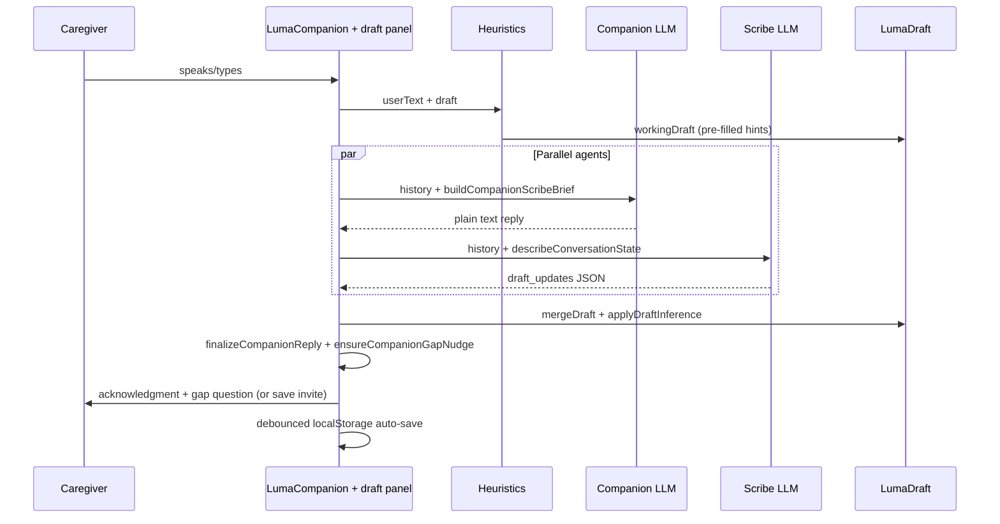
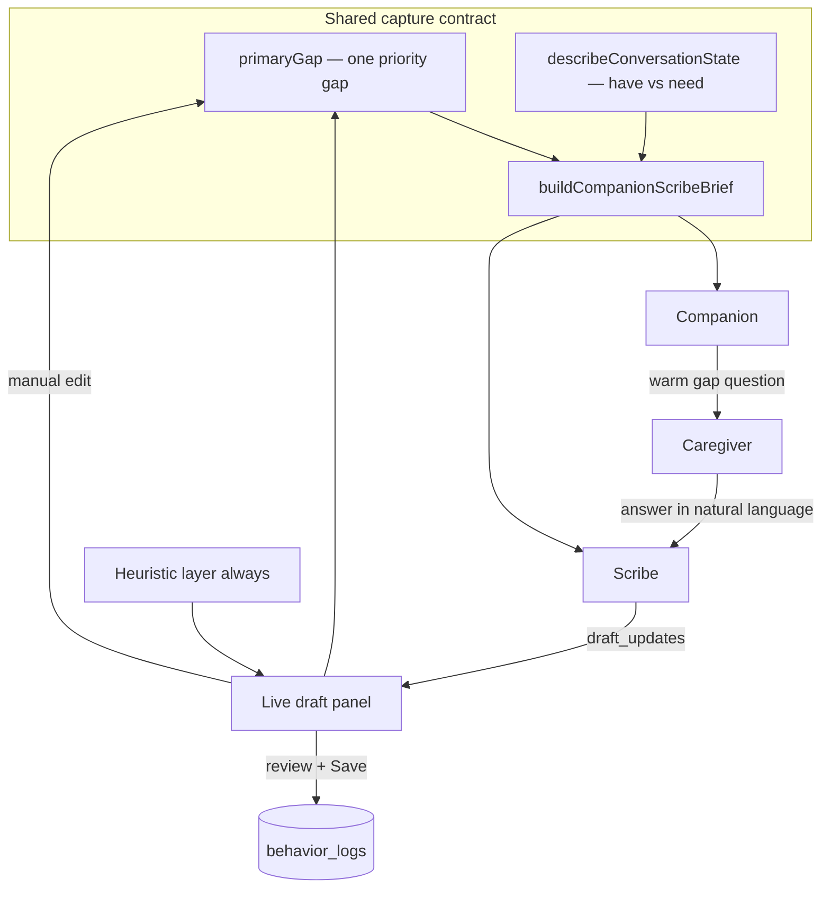
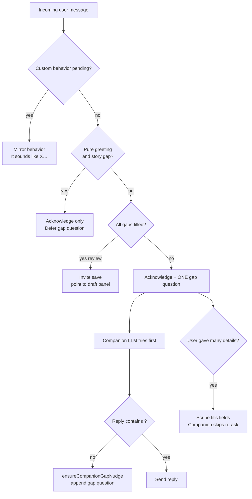

# Luma — AI Product Case Study (Dementia Caregiving)

**Role lens:** Senior AI Product Manager · Healthcare  
**Project:** Luma for Dementia caregivers  
**Scope:** Conversational capture → structured care observations → dual-audience longitudinal insights  
**Stack:** Next.js · SQLite · OpenAI/Anthropic · Web Speech · OpenAI TTS

---

## For executives & hiring managers (60 seconds)

**What it is:** A caregiver-facing web product that helps family members of people with dementia log hard behavioral episodes in natural language, build structured history over time, and walk into neurology visits with patterns — not scattered memories.

**Why it matters:** Dementia caregiving is a high-stress, high-cognitive-load context. Generic chatbots fail here because empathy and clinical-grade structure compete in one experience. Luma separates those jobs (Companion + Scribe), keeps the human in control of the record, and translates the same data differently for caregivers vs clinicians.

**What I did as AI PM:** Owned the product evolution from rule-based logging → failed single-agent chat → dual-agent architecture → dual-audience Synopsis. Made explicit tradeoffs on trust (no silent saves), activation (sample synopsis before data exists), and healthcare scope (observational tool, not diagnosis).

**Proof points:** Shipped end-to-end — voice/text capture, editable review, history, caregiver dashboard, clinician summary + PDF, heuristic fallback when models fail.

---

## Executive summary

Dementia caregivers need **clarity** after hard episodes — what happened, what might have contributed, and what actually helped — so patterns emerge over time and neurologist visits are productive. We did not jump straight to AI chat. We **earned** conversational Luma by shipping and learning through four deliberate product generations, all writing to the same structured care log.

| Generation | What we shipped | What we learned |
|------------|-----------------|-----------------|
| **MVP 1 — Clarity log** | Rule-based UI: dropdowns, chips, coach wizard | Structured data works; forms feel clinical and get skipped in the moment |
| **MVP 2 — Conversational text** | Single LLM chat mirroring the wizard field-by-field | Faster to start talking, but **robotic and survey-like** — one agent cannot chat and scribe |
| **MVP 3 — Companion + Scribe** | Two agents: empathetic companion + silent scribe | Warmth and extraction are different jobs; invisible capture erodes trust |
| **Current — Synopsis + trust loop** | Live draft, editable final log, voice, explicit save, **dual-audience report** | Data only creates value when translated per audience; caregivers need to see, edit, and own the record |

**North star:** Help caregivers reduce avoidable behavioral episodes by logging what happened, what contributed, and what worked — with an experience that feels like talking to someone who listens, not filling out paperwork for a neurologist.

This case study documents product decisions and tradeoffs — not just the final architecture.

---

## Problem & opportunity

| Stakeholder | Pain | Product implication |
|-------------|------|-------------------|
| **Caregiver** | Logging after a hard episode feels like homework; forms re-traumatize | Lead with empathy and narrative, not schema |
| **Care team / clinician** | Needs structured, comparable observation data over time | Same `behavior_logs` schema regardless of entry path |
| **Product / eng** | One LLM asked to chat *and* extract JSON produces stiff UX and missed fields | Split **Companion** (voice) and **Scribe** (structure) |
| **Activation** | Empty dashboard = no reason to keep logging | **Sample synopsis** shows future value before first log |

**Opportunity:** Use generative AI where it adds humanity (listening, reflecting) and keep structured UI where it adds control (review, edit, synopsis export). Use the **same underlying data** to serve two audiences with different mental models.

---

## Product evolution — how we got to Luma

We did not replace the clarity log. We **layered** conversation on top of it, corrected course when AI made the experience worse, then built downstream surfaces that prove why structure mattered.

### MVP 1 — The clarity log (structured, rule-based UI)

**Hypothesis:** Caregivers need reliable incident capture with enough structure to spot patterns and prepare for neurology visits.

**Shipped:** Guided check-in (coach wizard), shared catalogs (behaviors, triggers, strategies, outcomes), History, early synopsis/PDF path.

**Core value:** Consistent `behavior_logs` schema — what happened, when, how intense, contributors, what was tried, whether it helped.

**Limitation:** After agitation or wandering, multi-field forms feel like homework. Caregivers want to *talk*. We kept this layer as review surface and fallback.

---

### MVP 2 — Conversational logging (text-first Luma)

**Hypothesis:** Natural language lowers the barrier.

**What went wrong:**
- Luma sounded **robotic and clinical** — a spoken form
- Single model optimizing for JSON produced stiff, survey-like replies
- Extraction was **invisible** — “what did you get?”
- Questions anchored to **empty fields**, not the caregiver’s story

**PM decision:** Conversation direction was right; **single-agent, wizard-mirroring** was wrong. Separate how it **feels** from what gets **stored**.

---

### MVP 3 — Companion + Scribe (two agents, one draft)

**Hypothesis:** Split emotional labor from data extraction — and make them **partners**, not silos.

| Agent | Job | User sees |
|-------|-----|-----------|
| **Companion** (stronger model) | Listen, reflect, **lead with one gap question** after acknowledging | Warm plain text only |
| **Scribe** (lighter model) | Capture answers into `draft_updates` from the same transcript | Silent parallel extraction |
| **Heuristics** | Always-on backfill + offline fallback | Same draft, no API required |

**Partnership contract:** Both agents read the same **log capture status** (`buildCompanionScribeBrief` / `describeConversationState`). The companion asks; the scribe writes. Caregivers do not ask “what else do you need?” — the companion proactively moves through narrative gaps.

**Still not enough (MVP 3 initial):** Passive “weave in if it fits” nudges; invisible capture; occasional log readback in chat; voice UX issues (mic cut-off, robotic TTS).

**Current capture layer fixes:** Editable draft panel during chat; proactive gap nudges + `ensureCompanionGapNudge` backstop; shared companion–scribe brief.

---

### Current — Trust loop + dual-audience Synopsis

**Hypothesis:** The product must (1) feel emotionally safe and (2) produce a defensible record — then (3) turn that record into **actionable insight** per audience.

**Capture layer (trust loop):**
1. **Live editable draft panel** — companion points to on-screen capture, never reads fields aloud; user can correct anytime
2. **Narrative gaps + proactive companion** — story → timing → intensity → context → response → review; companion **leads** one gap per turn after validating feelings
3. **Companion–Scribe partnership** — shared capture status; companion asks, scribe extracts; gap backstop if LLM only empathizes
4. **Editable final log** — user fixes scribe errors before commit
5. **Explicit save** — nothing writes to DB until caregiver confirms
6. **Local auto-save** — session survives refresh; distinct from clinical record
7. **Voice UX** — continuous mic + manual Done; OpenAI TTS personas
8. **Mid-conversation reflect cards** — rule-based suggestions without breaking chat flow

**Insight layer (Synopsis — `/report`):**

| Tab | Default window | What the caregiver/clinician gets |
|-----|----------------|-----------------------------------|
| **For caregivers** | 30 days | Actionable dashboard: glance stats, recurring behaviors, reducible triggers, helpful vs rethink strategies, try-next-month tips, appointment questions |
| **For clinicians** | 180 days | Observational summary: coverage metrics, charts, trigger/strategy patterns, discussion questions; print/PDF export |

**Sample mode:** When `totalIncidents === 0`, show realistic mock synopsis with clear **Sample report** labeling and CTAs to start logging — activation before data exists.

**The balance:**

```
    Emotional companion              Structured clarity log
 (listen, pace, don’t retraumatize)  (history, patterns, synopsis)
                  │                            │
                  └──── draft + review ────────┘
                            │
                  Caregiver stays in control
                            │
                            ▼
              Dual-audience Synopsis
         (actionable for caregiver · observational for clinician)
```

---

## Skills this project demonstrates (senior AI PM in healthcare)

1. **Sequential product conviction** — Shipped structured foundation before AI; killed single-agent approach based on qualitative failure; did not abandon schema when UX failed.
2. **AI system design** — Parallel Companion + Scribe; heuristic fallback; prompt contracts forbidding clinical jargon in user-facing copy; vendor flexibility (OpenAI + Anthropic).
3. **Trust architecture as product strategy** — Live draft transparency, editable final log, no silent auto-write, local draft ≠ medical record, explicit disclaimers on every synopsis surface.
4. **Dual-audience product design** — Same `behavior_logs`, different mental models: caregiver wants “what can I change?”; clinician wants “what happened observably over time?” — without conflating the two.
5. **Activation design** — Sample synopsis demonstrates value at zero logs; period defaults differ by tab (30 vs 180 days) because use cases differ.
6. **Healthcare scope discipline** — Observational tool, not diagnosis/treatment; honest deployment limits (SQLite on serverless, no BAA); PHI-aware key handling.
7. **Voice as accessibility** — Continuous STT with manual Done; OpenAI TTS; skimmable on-screen formatting for tired readers.
8. **Downstream value chain thinking** — AI extraction serves longitudinal care narrative (History → Synopsis → PDF), not chat for its own sake.
9. **Iteration from qualitative signal** — “Robotic,” “survey-like,” “couldn’t see capture,” “morning logged as trigger” → targeted taxonomy and UX fixes.
10. **Scope management** — Quick log built but deprioritized from home nav; coach rules editor internal-only; caregiver PDF deferred until clinician path validated.

---

## Product architecture (conceptual)

### Turn loop — one caregiver message



### Companion–Scribe partnership



**Design principle:** Conversation follows *story gaps*, not wizard field order. The companion **leads**; the scribe **captures**. Reporting follows *audience intent*, not one-size-fits-all dashboards.

### Companion decision layers (what triggers which behavior)



| Layer | What triggers it | Companion behavior |
|-------|------------------|-------------------|
| **Greeting guard** | Short hi/thanks at start | Acknowledge only — no survey yet |
| **Behavior mirror** | Story described but no `behavior_code` | Reflect back warmly (*"It sounds like wandering might be what you're witnessing"*) or offer X or Y if ambiguous |
| **Gap lead (default)** | Any gap open after acknowledgment | Ask **one** question for `primaryGap` — timing, intensity, possible triggers, strategies, outcome |
| **Absorb mode** | Rich utterance; scribe captures multiple fields | Reflect what you heard; **don’t re-ask** filled gaps |
| **Draft mirror** | User asks what’s captured | Point to draft panel — never read fields aloud |
| **Save invite** | `review` gap or confirm step | Short save prompt; full editor on screen |
| **Gap backstop** | LLM empathizes without `?` | Append `buildCompanionGapQuestionBrief` |

**PM insight:** Users will not ask “what else do you need?” The product must treat gap questions as **default companionship**, not optional follow-ups after the user prompts.

---

## Key product decisions

### 1. Keep the clarity log schema; change the capture experience
Never fork data models. Luma, coach, and quick log all write `behavior_logs`. MVP 1 proved structured fields power Synopsis. MVP 2 failed on *capture UX*, not schema.

### 2. Companion + Scribe (not one prompt)
Two parallel model calls after single-agent failure. Empathy and JSON compliance compete in one context window. **Partnership:** shared `buildCompanionScribeBrief`; companion leads gap questions; scribe captures answers — not two silos on the same transcript. After validating feelings, companion **must** ask about the current `primaryGap`, with `ensureCompanionGapNudge` as backstop — caregivers will not ask “what else do you need?”

### 3. Show the draft, don’t read it aloud
Collapsible **Your draft log** panel. Invisible extraction caused “what did you get?” and duplicate survey readback.

### 4. Ask about the story, not the log
Thematic gaps (`primaryGap` in code), not wizard field order. Users rejected questions that existed only because a field was empty.

### 5. Editable final log + explicit save
DB write only on Save or explicit “yes.” Scribe will mislabel triggers. Caregivers must own the record clinicians see.

### 6. Local session auto-save (not DB auto-save)
Debounced `localStorage`; clear on commit. Draft resilience ≠ record integrity.

### 7. Dual-audience Synopsis from one data source
**Decision:** Separate caregiver dashboard (actionable) from clinician summary (observational + PDF).  
**Why:** Caregivers need “what can I reduce?” and “what helped?” Clinicians need coverage, trends, and neutral discussion prompts — not the same UI with different labels.  
**PM skill:** Audience segmentation without data fragmentation.

### 8. Sample mode as zero-data activation
**Decision:** Realistic mock synopsis when no logs exist; clear labeling; PDF disabled until real data.  
**Why:** Empty states kill retention. Showing the destination motivates the logging journey.  
**PM skill:** Sell the outcome before the habit exists.

### 9. Pattern confidence, not false precision
**Decision:** Label patterns as Strong / Early signal / Not enough data based on log counts.  
**Why:** Caregivers and clinicians both over-trust aggregates from n=2. Confidence badges set appropriate skepticism.  
**PM skill:** Responsible analytics UX in low-n health contexts.

### 10. Terminology: observations, not moments
**Decision:** User-facing copy uses **care observations** throughout (Luma draft panel, Synopsis, home).  
**Why:** “Moments” feels casual; “observations” aligns with clinical-adjacent documentation without claiming clinical authority.

---

## Iteration log (problems → resolutions)

### Trust & capture

| Issue | Resolution | PM takeaway |
|-------|------------|-------------|
| Greetings parsed as behaviors | Greeting guard + LLM-first path | First turn sets trust contract |
| Invisible extraction | Live draft panel; auto-expand on capture | Make AI legible without narrating JSON |
| One model, two jobs | Companion + Scribe split | Decompose AI workloads by success metric |
| Felt like clinical survey | Narrative gaps; forbid form language in prompts | Schema is backend; story is frontend |
| Companion too passive | Shared scribe brief + proactive gap questions + backstop | Users won't ask what's missing — product must lead |
| Survey-like behavior naming | Friend-style mirrors ("It sounds like wandering…") not "Would X fit?" | Clinical intake tone breaks trust in emotional moments |
| “Morning” as trigger not time | Exclude Time-category from trigger extraction | Domain taxonomy errors erode clinician trust |
| Scribe mis-extraction | Editable final log before save | Model confidence ≠ user consent |

### Voice & accessibility

| Issue | Resolution | PM takeaway |
|-------|------------|-------------|
| Mic cut off mid-sentence | Continuous STT + manual Done + 120s cap | Design for hands-busy, crisis-adjacent contexts |
| Robotic TTS | OpenAI TTS + voice picker; browser fallback | Brand tone includes voice, not just copy |
| Replies too long | Shorter companion prompt; block parsing | Stressed users need scannable UI |

### Downstream & activation

| Issue | Resolution | PM takeaway |
|-------|------------|-------------|
| Logs missing from History | Filter by `created_at`, local timezone | Validate full chain: capture → list → report |
| Empty Synopsis demotivating | Sample mode with mock data + CTAs | Activation = show the destination |
| One report for all users | Dual tabs with different defaults and sections | Same data, different jobs-to-be-done |
| CTA overlap in sample banners | Restructured layout; footer on both tabs | Polish on conversion surfaces matters |

---

## Conversation design (what “good” looks like)

**Bad (survey mode):**  
“What was the episode recency? Select mild, moderate, or severe.”

**Bad (passive companion):**  
Caregiver shares a hard story. Luma: *“That sounds really hard.”* (stops — waits for user to ask what else is needed)

**Good (narrative mode + partnership):**  
Caregiver: *“She wandered after lunch — hadn’t slept, got scared when the neighbor knocked.”*  
Luma: *“That sounds frightening. When did that happen — just now, or earlier today?”* (acknowledge + **one gap question**)  
Scribe (silent): wandering · earlier today · afternoon · fatigue · fear · …  
Draft panel updates live; caregiver can edit fields directly.  
Review: Caregiver edits, then saves.

**Gap sequence:** `story → timing → intensity → context → response → review`

**Example turn outcomes by layer:**

| User says | Gap | Companion does |
|-----------|-----|----------------|
| “Hi” | story | Welcome only — defer gap question |
| “She kept pacing and yelling at dinner” | story → timing | Reflect + ask when / part of day |
| Long story with timing + triggers in one breath | jumps toward intensity/response | Reflect; scribe absorbs; ask **next** open gap only |
| Behavior mirror pending | story | *"It sounds like wandering might be what you're witnessing — does that feel about right?"* |
| All fields captured | review | Invite save; show final editor |

See **Product architecture → Companion decision layers** above for full decision tree.

---

## Synopsis design (what “good” looks like)

**Caregiver tab — actionable, not analytical:**  
“Lighting appeared in 4 of 6 agitation logs — consider dimming rooms before evening.”  
Not: a donut chart with no next step.

**Clinician tab — observational, not diagnostic:**  
“6 behavior observations over 180 days; agitation/restlessness most frequent; evening peak; caregiver reports reduced intensity with [strategy].”  
Explicit framing: *Intended to support care conversations — not a clinical assessment or diagnosis.*

**Sample mode — honest preview:**  
Labeled **Sample report** at banner, badge, and header. PDF export gated until real data. CTAs on both tabs.

---

## Healthcare & responsible-AI notes

- **Not a medical device** — Supports caregiver documentation and reflection; does not diagnose, prescribe, or replace clinical judgment.
- **Observational framing** — Synopsis disclaimers on every surface; clinician view explicitly non-assessment.
- **PHI awareness** — API keys server-side only; demo uses local SQLite; production needs auth, encryption, BAA-covered vendors, persistent DB — documented as explicit gaps, not hand-waved.
- **Human confirmation** — Structured log committed only after user review/save.
- **Fallback honesty** — UI indicates browser TTS or heuristics vs OpenAI-powered paths.
- **Low-n humility** — Pattern confidence badges; no false precision from sparse data.

---

## Outcomes & metrics

### Demonstrated in product (qualitative / demo)

- Complete wandering/sleep/agitation story in 1–2 turns with visible draft fill-in
- Same log in **Today**, **History**, and **Synopsis** after save
- Voice path usable without typing; **Done** prevents premature cut-off
- Zero-log user sees realistic sample synopsis and clear path to first log
- Product survives API outage via heuristics without greeting-as-behavior failure

### Metrics I would instrument if shipping (senior PM framing)

| Metric | Why it matters |
|--------|----------------|
| **Log completion rate** | Capture UX success (Luma vs coach funnel) |
| **Time-to-save** | Friction proxy after episode |
| **Final-log edit rate** | Scribe accuracy proxy (by field: triggers, severity, timing) |
| **7-day / 30-day return logging** | Habit formation |
| **Synopsis visit rate** | Downstream value realization |
| **Sample → first log conversion** | Activation effectiveness |
| **PDF export rate** | Clinician-adjacent value |
| **Pattern section engagement** | Which caregiver insights drive action |

**North-star candidate:** *Weekly active caregivers who log ≥1 observation and view Synopsis within 7 days* — captures both habit and insight loop.

---

## Stack (portfolio sidebar)

| Layer | Choice |
|-------|--------|
| UI | Next.js 14, React, TypeScript, Tailwind |
| Conversation | Companion: GPT-4o / Claude Sonnet · Scribe: GPT-4o-mini / Claude Haiku |
| Speech in | Web Speech API (continuous STT, manual Done) |
| Speech out | OpenAI TTS (`tts-1`), browser fallback |
| Session | `localStorage` draft auto-save |
| Persistence | SQLite — shared `behavior_logs` schema |
| Reporting | Dual-tab Synopsis + `@react-pdf/renderer` PDF (clinician, real data) |
| Deploy | Vercel + env vars (SQLite ephemeral on serverless — documented limit) |

---

## Copy-ready portfolio blurb

> I evolved **Luma** through four product generations: a rule-based **clarity log** → failed single-agent chat (robotic, invisible capture) → **Companion + Scribe partnership** (shared capture contract, proactive gap leading, live editable draft, explicit save, voice) → **dual-audience Synopsis** that turns the same observations into an actionable caregiver dashboard and an observational clinician summary with PDF export. The north star: help dementia caregivers capture what happened and what worked — so they regain agency over avoidable behaviors and arrive at neurology visits with structured history — without the product feeling like paperwork. I made explicit healthcare scope, trust, and activation tradeoffs throughout.

---

## What I’d do next (roadmap — senior PM priorities)

| Priority | Initiative | Rationale |
|----------|------------|-----------|
| **P0** | Persistent DB + auth | Required for any real user study or pilot |
| **P0** | Scribe eval harness + edit-rate dashboard | Can’t improve AI capture without measuring field-level accuracy at save |
| **P1** | 5–8 contextual caregiver interviews | Validate save/edit flow and Synopsis sections under stress |
| **P1** | Caregiver PDF or share link | Clinician path exists; caregivers may want to bring summary to visits too |
| **P2** | Flag high-edit fields in clinician summary | “Caregiver edited triggers” as confidence signal for care team |
| **P2** | Offline-first mobile (PWA) | Hands-busy capture contexts |
| **Deprioritized** | Quick log on home | Luma + coach cover capture; avoid three-entry confusion until validated |

---

## Interview talking points (VP Product / hiring manager)

1. **“Why not just build a chatbot?”** — Because caregivers need a *record*, not a conversation. Chat is capture UX; structure is the product moat for patterns and visits.

2. **“How do you measure AI quality?”** — Edit rate at final log save, field-by-field. Companion quality = qualitative + completion; Scribe quality = quantitative + edit distance.

3. **“How do you handle HIPAA?”** — Honest scope: portfolio demo is local-first, not production HIPAA. Production path = auth, encryption, BAA vendors, audit trail — all explicitly designed as gaps, not afterthoughts.

4. **“Why two Synopsis tabs?”** — Same data, different jobs-to-be-done. Conflating caregiver action items with clinician observational summary creates trust problems on both sides.

5. **“Biggest product mistake?”** — Single-agent Luma mirroring the wizard. Fixed by splitting agents *and* changing conversation design from field gaps to story gaps.

6. **“What would you cut?”** — Quick log from home nav, caregiver PDF until clinician path validated, recent-moments UI until core dashboard proves value.

---

## Related technical doc

See [`ARCHITECTURE.md`](./ARCHITECTURE.md) for stack details, file layout, env vars, deployment gaps, and failure modes.
